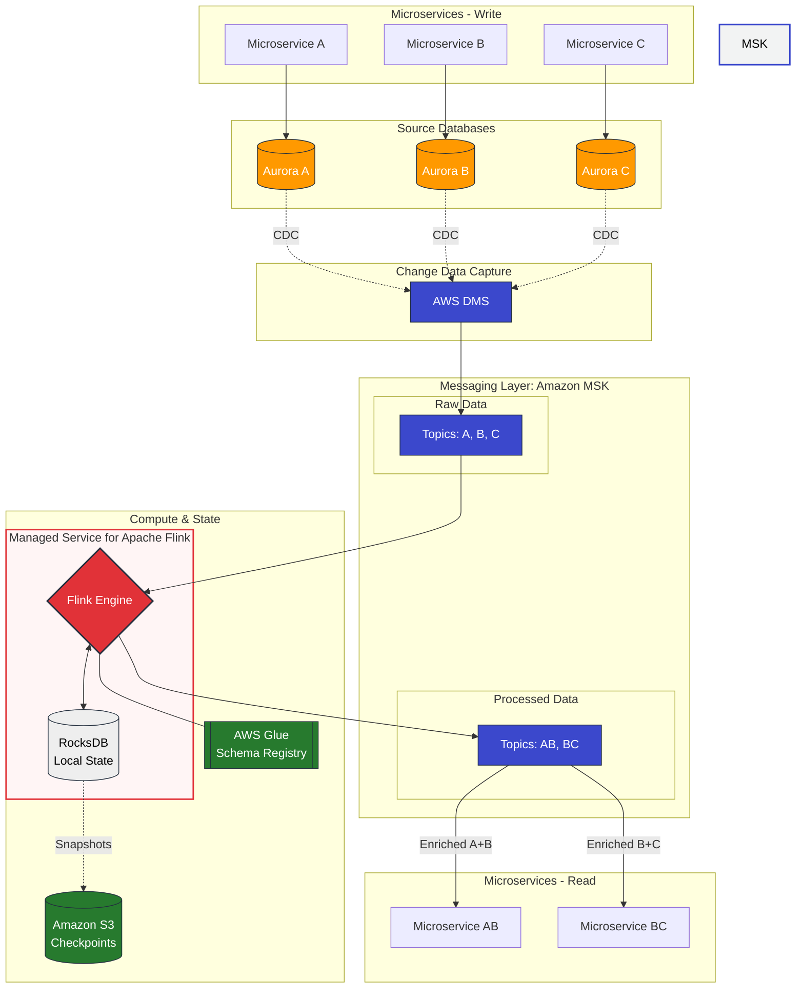

In this diagram, Microservices A, B, and C act as the writers (producers) on the left, and Microservices AB and BC act as the consumers of enriched data on the right.

AWS Managed CDC & Enrichment Architecture


Key Component Mapping
| On-Prem Stack | AWS Managed Equivalent | Role in the Architecture |
| :--- | :--- | :--- |
| **PostgreSQL** | **Amazon Aurora (PG)** | High-performance relational storage for services A, B, and C. |
| **Debezium** | **AWS Database Migration Service (DMS)** | Captures row-level changes (CDC) from Aurora and streams them. |
| **Apache Kafka** | **Amazon MSK** | The central message bus for raw and enriched events. |
| **Apache Flink** | **Managed Service for Apache Flink** | Joins streams (A+B and B+C) using **RocksDB** for real-time state. |
| **Apicurio** | **AWS Glue Schema Registry** | Manages Avro/JSON schemas for serialization consistency. |

Why This Architecture Works
Seamless Decoupling: Microservices A, B, and C remain focused on business logic. They write to their respective databases without any knowledge of Kafka, Flink, or the enrichment process.

Operational Excellence: Using AWS DMS eliminates the overhead of managing a dedicated Kafka Connect cluster, reducing the "moving parts" in your infrastructure.

Managed State Reliability: Managed Service for Apache Flink handles the heavy lifting of state management. It automatically manages RocksDB on local NVMe storage for low-latency joins and performs incremental checkpoints to Amazon S3, ensuring 99.9%+ availability without manual tuning of JVM or disk parameters.

Estimated Monthly Cost (100 TPS / ~260M events per month)

Estimated Monthly Cost (Projected)
Region: US East (N. Virginia)

Throughput: ~100 writes/sec (~260M events/month)

| Service | Component | Monthly Cost (Serverless) | Monthly Cost (Provisioned) | Cost Driver |
| :--- | :--- | :--- | :--- | :--- |
| **Amazon Aurora** | **Database (PostgreSQL)** | $106.00 | $85.00 | Storage + I/O + Instance Type. |
| **AWS DMS** | **CDC Replication** | $63.00 | $63.00 | Instance hours (e.g., dms.t3.medium). |
| **Amazon MSK** | **Kafka Streaming** | $584.00 | $180.00 | Cluster hours + Throughput + Partitions. |
| **Managed Flink** | **Stream Processing** | $160.00 | $160.00 | Kinesis Processing Units (2 KPU). |
| **AWS Glue** | **Schema Registry** | $0.00 | $0.00 | Free Tier (up to 1M requests per month). |
| **TOTAL** | | **~$913.00** | **~$488.00** | |

---

#### 💡 Key Takeaways for Optimization:
* **MSK Serverless vs. Provisioned:** Serverless is great for "zero-management," but it carries a high base fee of ~$0.75/hr. Switching to **Provisioned m7g.large** instances can save you over **$400/month** if your load is steady.
* **Aurora Serverless v2:** For 100 TPS, Aurora is highly efficient, scaling down to 0.5 ACU during idle periods.
* **Managed Flink:** The minimum cost is 2 KPUs (1 for the application and 1 for orchestration). This is the "luxury" part of the stack that replaces manual Flink cluster maintenance.

Netflix: Processes trillions of events per day using Flink. Peak loads are ~20 million events per second on clusters of hundreds of nodes.
Alibaba: During sales days (Double 11), their Flink clusters process over 4 billion events per second in total, with latency of less than a second.


# The Role of Apicurio Registry (AWS Glue Schema Registry) in EDA
In an Event-Driven Architecture (EDA), data is constantly in motion. When hundreds of services exchange messages, a critical challenge arises: How do you guarantee that the consumer understands what the producer sent?

Apicurio Registry acts as a centralized "library" or schema store for data structures (Apache Avro, JSON Schema, Google Protobuf).

## Solving "Broken Contracts"
In EDA, Producers and Consumers are decoupled. If a Producer changes a message structure (e.g., deletes a mandatory field), the Consumer will fail with a parsing error.

Schema Registry: Instead of sending the entire schema with every message, the Producer sends only a Schema ID.

Deserialization: The Consumer fetches the schema from Apicurio using this ID and correctly parses the data.

## Schema Evolution and Compatibility
Systems are dynamic. Fields are added, and data types change. Apicurio enforces compatibility rules:
Backward: New schemas can read data produced by old schemas.
Forward: Old schemas can read data produced by new schemas.
Full: Bi-directional compatibility.
Note: If a developer tries to register a schema that breaks these rules, Apicurio rejects the update, preventing a "breaking change" from reaching production.

## Why Avro + Flink + Apicurio is the "Golden Stack"
While Google Protobuf is highly efficient for point-to-point microservices, Apache Avro is the industry standard for Flink-based EDA for several reasons:
Native Serialization: Flink recognizes Avro types out-of-the-box. It uses a high-performance AvroSerializer that avoids the overhead of generic serializers like Kryo.
State Evolution: Flink stores data in "State" (checkpoints/savepoints). Avro allows you to update your data schema and still successfully recover old state from a checkpoint—a task that is notoriously difficult with Protobuf.
Dynamic Processing: Avro allows working with GenericRecord. This means Flink can process events dynamically by fetching schemas from Apicurio at runtime without needing to recompile code for every minor change.

## Practical Example: Flink SQL Enrichment
Flink SQL allows for Stream-to-Stream Joins (Enrichment). Below is an example of enriching a ProgressChanged event with data from a ProfileChanged event.

1. Data Definitions (Avro)
ProfileChanged: user_id (long), user_name (string), country (string).
ProgressChanged: user_id (long), score (int), level (int).

2. Table DDL in Flink SQL
Using the Kafka connector and Apicurio integration:
```sql
-- Profile Table (Created as a Temporal Table for lookups)
CREATE TABLE user_profiles (
    user_id BIGINT,
    user_name STRING,
    country STRING,
    proc_time AS PROCTIME(), -- Processing time for the join
    PRIMARY KEY (user_id) NOT ENFORCED
) WITH (
    'connector' = 'kafka',
    'topic' = 'user-profiles-topic',
    'properties.bootstrap.servers' = 'kafka:9092',
    'value.format' = 'avro-confluent', -- Apicurio is compatible with this format
    'value.avro-confluent.url' = 'http://apicurio-registry:8080/apis/registry/v2'
);

-- Progress Table (The main event stream)
CREATE TABLE user_progress (
    user_id BIGINT,
    score INT,
    level INT,
    event_time TIMESTAMP(3),
    WATERMARK FOR event_time AS event_time - INTERVAL '5' SECOND
) WITH (
    'connector' = 'kafka',
    'topic' = 'user-progress-topic',
    'properties.bootstrap.servers' = 'kafka:9092',
    'value.format' = 'avro-confluent',
    'value.avro-confluent.url' = 'http://apicurio-registry:8080/apis/registry/v2'
);
```

3. Enrichment Query (Temporal Join)
This query enriches every progress event with the latest available profile data for that user.
```sql
SELECT 
    p.user_id,
    u.user_name,
    u.country,
    p.score,
    p.level,
    p.event_time
FROM user_progress p
LEFT JOIN user_profiles FOR SYSTEM_TIME AS OF p.proc_time AS u
ON p.user_id = u.user_id;
```

Conclusion
Apicurio Registry acts as the governance layer for EDA. By using Avro within Flink, you ensure:
Minimal CPU/Network usage (Binary format).
Automated Schema Management (Integration with Flink SQL).
Reliable State Recovery (Schema evolution support).
