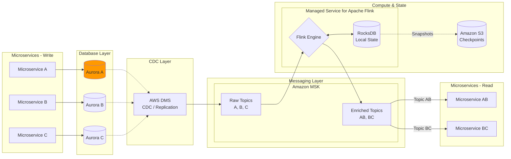

In this diagram, Microservices A, B, and C act as the writers (producers) on the left, and Microservices AB and BC act as the consumers of enriched data on the right.

AWS Managed CDC & Enrichment Architecture

Key Component Mapping
| On-Prem Stack | AWS Managed Equivalent | Role in the Architecture |
| :--- | :--- | :--- |
| **PostgreSQL** | **Amazon Aurora (PG)** | High-performance relational storage for services A, B, and C. |
| **Debezium** | **AWS Database Migration Service (DMS)** | Captures row-level changes (CDC) from Aurora and streams them. |
| **Apache Kafka** | **Amazon MSK** | The central message bus for raw and enriched events. |
| **Apache Flink** | **Managed Service for Apache Flink** | Joins streams (A+B and B+C) and performs real-time enrichment. |
| **Apicurio** | **AWS Glue Schema Registry** | Manages Avro/JSON schemas for serialization consistency. |

Why this works for your use case:
Decoupling: Microservices A, B, and C don't need to know about the enrichment logic; they just write to the DB.

Operational Excellence: AWS DMS eliminates the need to manage a Kafka Connect cluster manually.

Scalability: Managed Service for Apache Flink (formerly Kinesis Data Analytics) handles the state management (RocksDB) and checkpoints in S3 automatically, so you don't have to tune JVM parameters or disk space for the Flink JobManagers/TaskManagers.

Estimated Monthly Cost (100 TPS / ~260M events per month)

### Estimated Monthly Cost (AWS Managed Stack)
**Region:** US East (N. Virginia)  
**Throughput:** ~100 writes/sec (~260M events/month)

| Service | Component | Monthly Cost (Serverless) | Monthly Cost (Provisioned) | Cost Driver |
| :--- | :--- | :--- | :--- | :--- |
| **Amazon Aurora** | Database (PostgreSQL) | $106.00 | $85.00 | Storage + I/O + Instance |
| **AWS DMS** | CDC Replication | $63.00 | $63.00 | dms.t3.medium instance |
| **Amazon MSK** | Kafka Streaming | $584.00 | $180.00 | Cluster hours + Throughput |
| **Managed Flink** | Stream Processing | $160.00 | $160.00 | 2 KPU (Processing Units) |
| **Glue Registry** | Schema Management | $0.00 | $0.00 | Free Tier (up to 1M req) |
| **TOTAL** | | **~$913.00** | **~$488.00** | |

---

#### 💡 Key Takeaways for Optimization:
* **MSK Serverless vs. Provisioned:** Serverless is great for "zero-management," but it carries a high base fee of ~$0.75/hr. Switching to **Provisioned m7g.large** instances can save you over **$400/month** if your load is steady.
* **Aurora Serverless v2:** For 100 TPS, Aurora is highly efficient, scaling down to 0.5 ACU during idle periods.
* **Managed Flink:** The minimum cost is 2 KPUs (1 for the application and 1 for orchestration). This is the "luxury" part of the stack that replaces manual Flink cluster maintenance.
