In this diagram, Microservices A, B, and C act as the writers (producers) on the left, and Microservices AB and BC act as the consumers of enriched data on the right.

AWS Managed CDC & Enrichment Architecture

```mermaid
graph TD
    %% Группа Продюсеров
    subgraph Producers [Microservices - Write]
        A[Microservice A]
        B[Microservice B]
        C[Microservice C]
    end

    %% Группа Баз Данных
    subgraph Storage [Source Databases]
        DB_A[(Aurora A)]
        DB_B[(Aurora B)]
        DB_C[(Aurora C)]
    end

    %% Слой CDC
    subgraph Ingestion [Change Data Capture]
        DMS[AWS DMS]
    end

    %% Шина Данных
    subgraph Streaming [Messaging Layer: Amazon MSK]
        direction TB
        subgraph RawTopics [Raw Data]
            T_Raw[Topics: A, B, C]
        end
        subgraph EnrichedTopics [Processed Data]
            T_Enriched[Topics: AB, BC]
        end
    end

    %% Процессинг
    subgraph Processing [Compute & State]
        direction LR
        subgraph FlinkApp [Managed Service for Apache Flink]
            Flink{Flink Engine}
            Rocks[(RocksDB<br/>Local State)]
            Flink <--> Rocks
        end
        Glue[[AWS Glue<br/>Schema Registry]]
        S3[(Amazon S3<br/>Checkpoints)]
    end

    %% Потребители
    subgraph Consumers [Microservices - Read]
        MS_AB[Microservice AB]
        MS_BC[Microservice BC]
    end

    %% Потоки данных
    A --> DB_A
    B --> DB_B
    C --> DB_C

    DB_A & DB_B & DB_C -.->|CDC| DMS
    DMS --> T_Raw
    
    T_Raw --> Flink
    Flink --- Glue
    Rocks -.->|Snapshots| S3
    
    Flink --> T_Enriched
    
    T_Enriched -->|Enriched A+B| MS_AB
    T_Enriched -->|Enriched B+C| MS_BC

    %% Улучшенная стилизация (AWS Colors & Modern UI)
    style Aurora fill:#3b48cc,stroke:#232f3e,stroke-width:2px,color:#fff
    style DB_A fill:#f90,stroke:#232f3e,color:#fff
    style DB_B fill:#f90,stroke:#232f3e,color:#fff
    style DB_C fill:#f90,stroke:#232f3e,color:#fff
    
    style MSK fill:#f2f3f3,stroke:#3b48cc,stroke-width:2px
    style T_Raw fill:#3b48cc,stroke:#232f3e,color:#fff
    style T_Enriched fill:#3b48cc,stroke:#232f3e,color:#fff

    style Flink fill:#e13238,stroke:#232f3e,stroke-width:2px,color:#fff
    style Rocks fill:#444,stroke:#
```

Key Component Mapping
| On-Prem Stack | AWS Managed Equivalent | Role in the Architecture |
| :--- | :--- | :--- |
| **PostgreSQL** | **Amazon Aurora (PG)** | High-performance relational storage for services A, B, and C. |
| **Debezium** | **AWS Database Migration Service (DMS)** | Captures row-level changes (CDC) from Aurora and streams them. |
| **Apache Kafka** | **Amazon MSK** | The central message bus for raw and enriched events. |
| **Apache Flink** | **Managed Service for Apache Flink** | Joins streams (A+B and B+C) using **RocksDB** for real-time state. |
| **Apicurio** | **AWS Glue Schema Registry** | Manages Avro/JSON schemas for serialization consistency. |

Why This Architecture Works
Seamless Decoupling: Microservices A, B, and C remain focused on business logic. They write to their respective databases without any knowledge of Kafka, Flink, or the enrichment process.

Operational Excellence: Using AWS DMS eliminates the overhead of managing a dedicated Kafka Connect cluster, reducing the "moving parts" in your infrastructure.

Managed State Reliability: Managed Service for Apache Flink handles the heavy lifting of state management. It automatically manages RocksDB on local NVMe storage for low-latency joins and performs incremental checkpoints to Amazon S3, ensuring 99.9%+ availability without manual tuning of JVM or disk parameters.

Estimated Monthly Cost (100 TPS / ~260M events per month)

Estimated Monthly Cost (Projected)
Region: US East (N. Virginia)

Throughput: ~100 writes/sec (~260M events/month)

| Service | Component | Monthly Cost (Serverless) | Monthly Cost (Provisioned) | Cost Driver |
| :--- | :--- | :--- | :--- | :--- |
| **Amazon Aurora** | **Database (PostgreSQL)** | $106.00 | $85.00 | Storage + I/O + Instance Type. |
| **AWS DMS** | **CDC Replication** | $63.00 | $63.00 | Instance hours (e.g., dms.t3.medium). |
| **Amazon MSK** | **Kafka Streaming** | $584.00 | $180.00 | Cluster hours + Throughput + Partitions. |
| **Managed Flink** | **Stream Processing** | $160.00 | $160.00 | Kinesis Processing Units (2 KPU). |
| **AWS Glue** | **Schema Registry** | $0.00 | $0.00 | Free Tier (up to 1M requests per month). |
| **TOTAL** | | **~$913.00** | **~$488.00** | |

---

#### 💡 Key Takeaways for Optimization:
* **MSK Serverless vs. Provisioned:** Serverless is great for "zero-management," but it carries a high base fee of ~$0.75/hr. Switching to **Provisioned m7g.large** instances can save you over **$400/month** if your load is steady.
* **Aurora Serverless v2:** For 100 TPS, Aurora is highly efficient, scaling down to 0.5 ACU during idle periods.
* **Managed Flink:** The minimum cost is 2 KPUs (1 for the application and 1 for orchestration). This is the "luxury" part of the stack that replaces manual Flink cluster maintenance.
